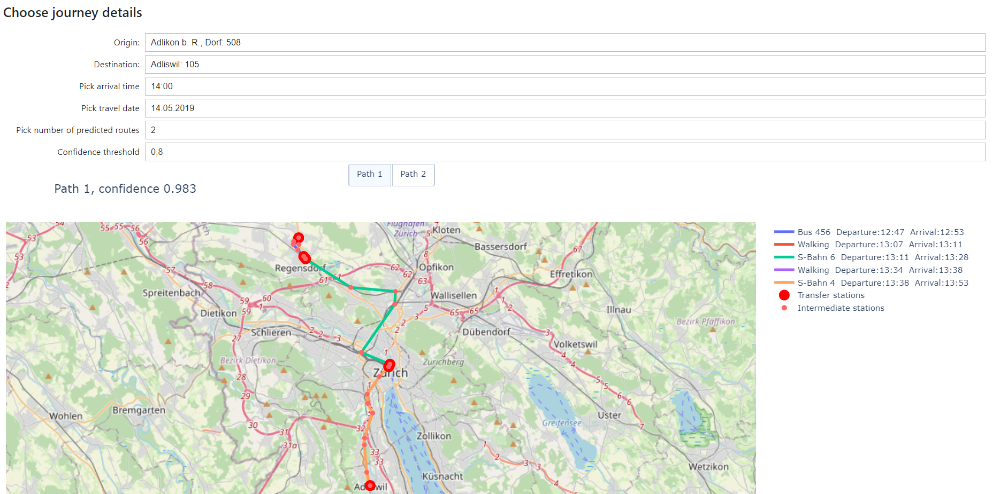

# Robust Journey Planning

by
- Fedor Moiseev
- Dhruti Shah
- Pushkar Jajoria
- Jan Bauer

In this project, we have build a Robust Journey Planning system which uses the data provided by SBB which ameliorates the problem of journey planning with travel delays uncertainities. The program computes the optimal route from A to B in the city of Zurich, considering that the traveler wants to arrive at his destination before a fixed arrival deadline with a probability above a chosen certainty threshold. The application has been built upon the basic assumptions listed as part of the overview. More detailed task description you can see at [TASK_DESCRIPTION.md](./TASK_DESCRIPTION.md).

### HOW-TO
To run our demo and test our approach, you can follow these steps:
1. Create an environment with at least 4Gb RAM.
2. Connect to it. Now you have 2 options:
    1. Use voila to run our demo: replace `/lab?` in the end of URL with `/voila`. In the menu on this page, go to notebooks folder and open `FINAL-voila.ipynb` notebook (it could take some time to load models from disc). When it's loaded, you could select origin, destination, date, arrival time, desired confidence threshold and number of routes to predict and our model will suggest you routes and display them on a map. **Be careful: Increasing desired number of routes to a value too big can significantly slow down prediction, so we suggest to you to try it with this parameter <= 3.**
    2. Alternatively, you can run our demo as usual Jupyter notebook. Just go to notebooks folder in Jupyter lab, open `FINAL-voila.ipynb` notebook and run it from start to end. In the last cell interactive widget will appear to set desired parameters.

Steps above describe how you can run our pretrained models and graph that we saved on GIT LFS (to save your time, because full data preparation and model training takes a lot of time). If you want to repeat all steps, refer to [Repeat All Steps](#repeat-all-steps) section.

We describe our approach in this video: [https://youtu.be/Ndt-EY0FZ18](https://youtu.be/Ndt-EY0FZ18), you can also find some details in the [presentation](https://drive.google.com/file/d/10NDn0Sb39IpjOIcTiS5S6wJJYgh93BgL/view?usp=sharing) and [Our Approach](#our-approach) section. 

### Project Structure
The solution is contained within the following five notebooks, that lie in [notebooks](./notebooks) folder.
1. [`Data_Preparation.ipynb`](./notebooks/Data_Preparation.ipynb) - notebook that filters and preprocess timetable data.
2. [`Graph_Creation.ipynb`](./notebooks/Graph_Creation.ipynb) - notebook that creates a graph from preprocessed data.
3. [`Delay_Prediction.ipynb`](./notebooks/Delay_Prediction.ipynb) - notebook that trains delay prediction model.
4. [`Route_Generation.ipynb`](./notebooks/Route_Generation.ipynb) - notebook that generates routes using different algorthims and saves on disk for further validation.
5. [`Validation.ipynb`](./notebooks/Validation.ipynb) - notebook that validates our algorithm and compares it with the baseline.
6. [`FINAL-voila.ipynb`](./notebooks/FINAL-voila.ipynb) - notebook with demo for our approach. Could be run using Voila or as usual Jupyter notebook.

### Our Approach
- **Data Preparation:** In order to prepare the data, PySpark was used to load the txt files into memory and employ basic filtering. Only stations, routes and trips within a 15 km radius of Zurich were taken into account. The filtered and prepared data is written back to HDFS for easier access. See [`Delay_Prediction.ipynb`](./notebooks/Delay_Prediction.ipynb) for more details.
- **Graph Creation:** Once we have the data available on RAM, we can create a MultiDiGraph G(V,E) using the `networkx` library. We stores each station as a vertex. The edges correspond to a unique trip between any 2 vertices. As there are multiple trips between 2 connected stations, the graph can also have multiple edges between any 2 stations. We also add walking edges between any 2 stations/vertices if the distance between them is less or equal to 500m. See [`Graph_Creation.ipynb`](./notebooks/Graph_Creation.ipynb) for more details.
- **Graph Traversals:** We can use the graph created above to find the shortest path between any two stations. We use a modified version to Dijkstra's to do this. For creating 'k' loopless simple shortest paths between an origin station and the destination station we use the Yen's Algorithm[[1]](#References). See [`notebooks/utils/graph_utils.py`](notebooks/utils/graph_utils.py) for more details.
- **Modeling Delays:** A linear regression model is used to predict the expected delay based on multiple features like the type of transportation, the stop_id, week_of_year etc.<br/> The delay (converted to 1 min bins) probablities are then modeled using a logistic regression model. See [`Delay_Prediction.ipynb`](./notebooks/Delay_Prediction.ipynb) for more details.
- **Trip Planning:** To plan a trip with a success probability higher than the threshold we employ a heuristic based approach. 
    1. We use Dijkstra's on the computed graph to find the shortest path between source and destination. 
    2. Compute it's success probability using the delay model.
    3. If the success probability is lower than the threshold, we add 1 minute to the waiting time at transfer stations (for example, 2 minutes to 3 minutes).
    4. Repeat from step 1 and return the path when the probability is above the threshold.
- **Result Validation:**
In order to, validate a trip predicted by the route planning algorithm, the list of nodes (stops) and edges (connecting trips), is compared with the same trip in the SBB real-world data. It gets checked weather the predicted route leads to one of the following real-world events: SUCCESSFUL TRIP, MISSED CONNECTION, CONNECTION_NOT_FOUND. 50 random pairs of origin and destination stations are sampled and the three different route planning algorithms are used to find the optimal route. For each of these we then find the fraction of successful trips by computing $$\frac{\text{Num Successful Trips}}{\text{Total Trips}}$$. (Ignoring 'Connection not found'). The following results have been observed:

| Algorithm                                           | Percentage of successful trips|
|:---------------------------------------------------:|:-----------------------------:|
| Shortest path algorithm (no delay considerations)   | 72.4%                         |
| Our algorithm (confidence 0.8)                      | 90.3%                         |   
| Our algorithm (confidence 0.96)                     | 96.7%                         | 

As you can see, our approach allows to significantly increase success probability of the trip!

- **Visualizations:** We vizualize the output of our algorithm, ie the route from the origin to the destination station, along with transfer stations highlighted. We also show which connections to take for each trip. Further, the probability of the trip success is also shown. In case of multiple predicted routes, the user can choose to view alternate routes too. The details of our visualization implementation can be found in [`viz_utils.py`](./notebooks/utils/viz_utils.py). Below we show an example of vizualization. 

### Repeat All Steps
To repeat all steps of our project, follow the following order:
1. Create Renku environment with 8Gb RAM (4Gb could work, but you will have to carefully free memory after every notebook).
2. Run [`Data_Preparation.ipynb`](./notebooks/Data_Preparation.ipynb) to pre-process the data and save relevant data to HDFS.
3. Run [`Graph_Creation.ipynb`](./notebooks/Graph_Creation.ipynb) to use the data prepared in previous step to create the graph to be used for route planning.
4. Run [`Delay_Prediction.ipynb`](./notebooks/Delay_Prediction.ipynb) to train the regression model and save the trained model to HDFS. We will use this trained model in the final algorithm.
5. In 3 cell of [`FINAL-voila.ipynb`](./notebooks/FINAL-voila.ipynb) comment first line and uncomment second line. It should look like this:
```python
# username = "moiseev" # Use this line if you want to use pretrained models.
username = os.environ['JUPYTERHUB_USER'] # Uncomment this line if you want to use your models.
```
It is required to use your date and models instead of pretrained ones. 

6. Do the same in the first cell of [`Validation.ipynb`](./notebooks/Validation.ipynb).
7. Follow steps from [HOW-TO](#how-to) section to run demo on obtained graph and model.
8. Run [`Route_Generation.ipynb`](./notebooks/Route_Generation.ipynb) to create and save routes for validation.
9. Finally for validation run [`Validation.ipynb`](./notebooks/Validation.ipynb) to check if the predicted routes are valid using the real-world SBB data.

